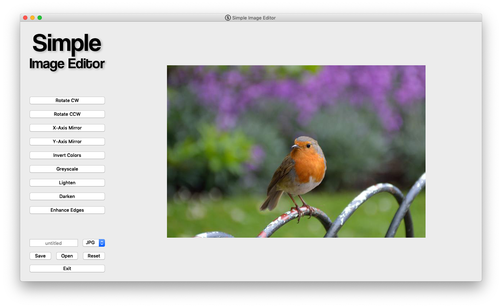
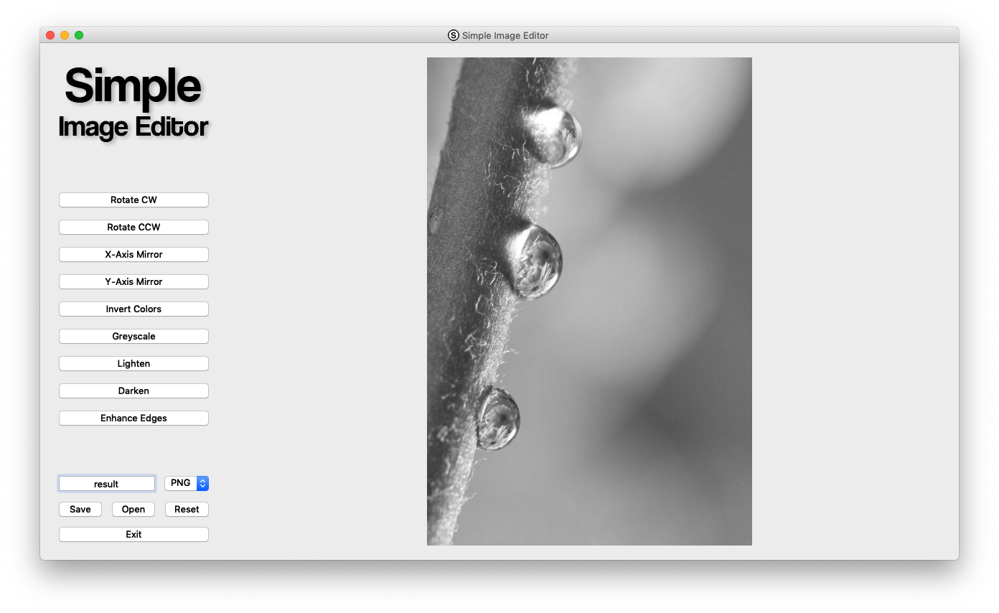

# Simple Image Editor (SIE)
### Simple utility which lets the user perform basic image operations. Created as a semestral work in subject BI-PYT at FIT CTU.
Supported operations:

 - Rotate (by 90°)
 - Mirror
 - Invert Colors
 - Greyscale
 - Lighten
 - Darken
 - Enhance Edges

### Screenshots
   |  
:------------------------------------:|:------------------------------------: